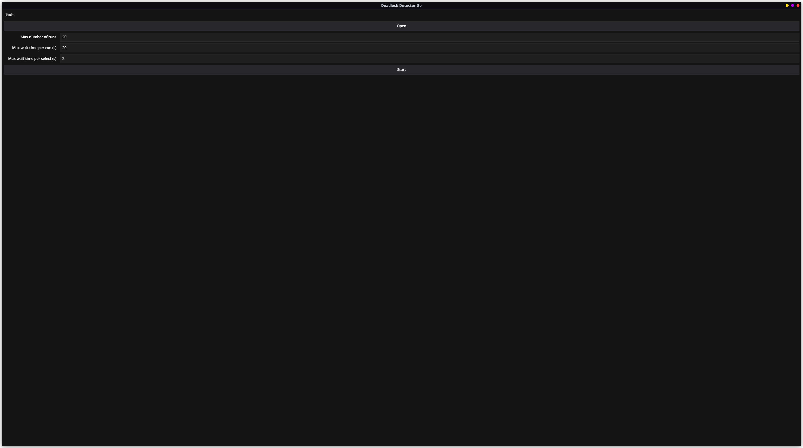
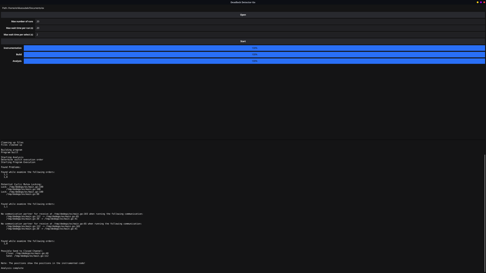

# Deadlock Detector Go: Dynamic Analysis of Message Passing Go Programs

Warning: The code, particularly the instrumenter, contains multiple bug which means, that the analyzer can only run with manual corrections.


## What
Program to run a dynamic analysis of concurrent Go programs to detect 
possible deadlock situations.

### Mutexes
For mutexes cyclic deadlocks as well as deadlocks by double locking can be detected.

Cyclic Deadlocks are the result of cyclicly blocking routines.
The following program shows an example:
```go
func main() {
	x := sync.Mutex{}
	y := sync.Mutex{}

	go func() {
		x.Lock()  // 1
		y.Lock()  // 2
		y.Unlock()
		x.Unlock()
	}()

	y.Lock()  // 3
	x.Lock()  // 4
	x.Unlock()
	y.Lock()
}
```
If (1) and (3) run simultaneously and before (2) or (4) run, 
both routines block on (2) and (4) causing a cyclic deadlock.

Double locking arise if a mutex is locked multiple times by the same routine without unlocking. The following program shows an example:
```go
func main() {
	x := sync.Mutex{}

	x.Lock() 
	x.Lock()
}
```
In this case the routine blocks it self, which leads to a deadlock.

The program is able to differentiate between mutexes and rw-mutexes. The following example therefore does not lead to any problem because RLock operations do not block each other:
```go
func main() {
	x := sync.RWMutex{}
	y := sync.RWMutex{}

	go func() {
		x.RLock()  // 1
		y.Lock()  // 2
		y.Unlock()
		x.Unlock()
	}()

	y.Lock()  // 3
	x.RLock()  // 4
	x.Unlock()
	y.Lock()
}
```
The program is able to detect problems like these.

### Channels
Channels can also lead to blocking situations. Let's use the 
following program as an example:
```go
func main() {
	x := make(chan int)

	go func() {
		x <- 1  // 1
		<-x     // 2
	}()

	go func() {
		x <- 1  // 3
	}()

	<-x         // 4
	time.Sleep(time.Second)
}
```
If (1) communicates with (4) and (3) with (2) everything is fine. But if (3) communicates with (4) (1) has no valid communication partner and will therefore block the routine forever. The program is able to detect situations like these. 
It can to a certain extend also detect blocking problems 
with buffered channels. 

To detect problems caused or hidden by select statements, the program is analyzed multiple times with different preferred select cases in the different runs. 

## How to
Download the ```/src``` folder and run ```go build``` in it to build the program. 

This will create an executable.

By running the executable it will open the following window:

With open, you can select the folder containing the program which is supposed to be analyzed. Please be aware, that clicking the ```Cancel``` button in the folder selection window can cause the program to crash.

The 4 input field allow you to set certain setting. All values must be non-negative integers.
- Max number of runs: maximum number of runs to analyze. For each run another 
combination is selected for the preferred case in select statements. Has only an effect 
if the number of combinations is bigger than the selected value. This can reduce the runtime 
but will also reduce the chance of finding blocking situations.
- Max wait time per run: number of seconds per run after which the program will assume, that the program is run into an actual deadlock. In this case the program will be canceled and then analyzed. Set 0 to disable (can cause the program to block forever, not advised).
- Max wait time per select: number of seconds a select statement will wait for its preferred case before it chooses a random valid case. Set 0 to disable.

Clicking the start button will start the analysis. After the analysis the window 
will lock similar to the following image:

The image shows the analysis (not all of the output is visible) of the following program:
```go
package main

import (
	"sync"
)

func main() {
	var m sync.Mutex
	var n sync.Mutex

	c := make(chan int)
	d := make(chan int, 1)

	go func() {
		d <- 1
		select {
		case <-d:
			close(c)
		default:
			<-c
		}
	}()

	go func() {
		m.Lock()
		n.Lock()
		n.Unlock()
		m.Unlock()
		<-c
	}()

	n.Lock()
	m.Lock()
	m.Unlock()
	n.Unlock()
	c <- 1
}
```

## Note 
- The program must contain a go.mod file.
- The program must be compilable with go build. The created binary must be directly runnable.
- GoImports must be installed
- Only tested with Linux 

