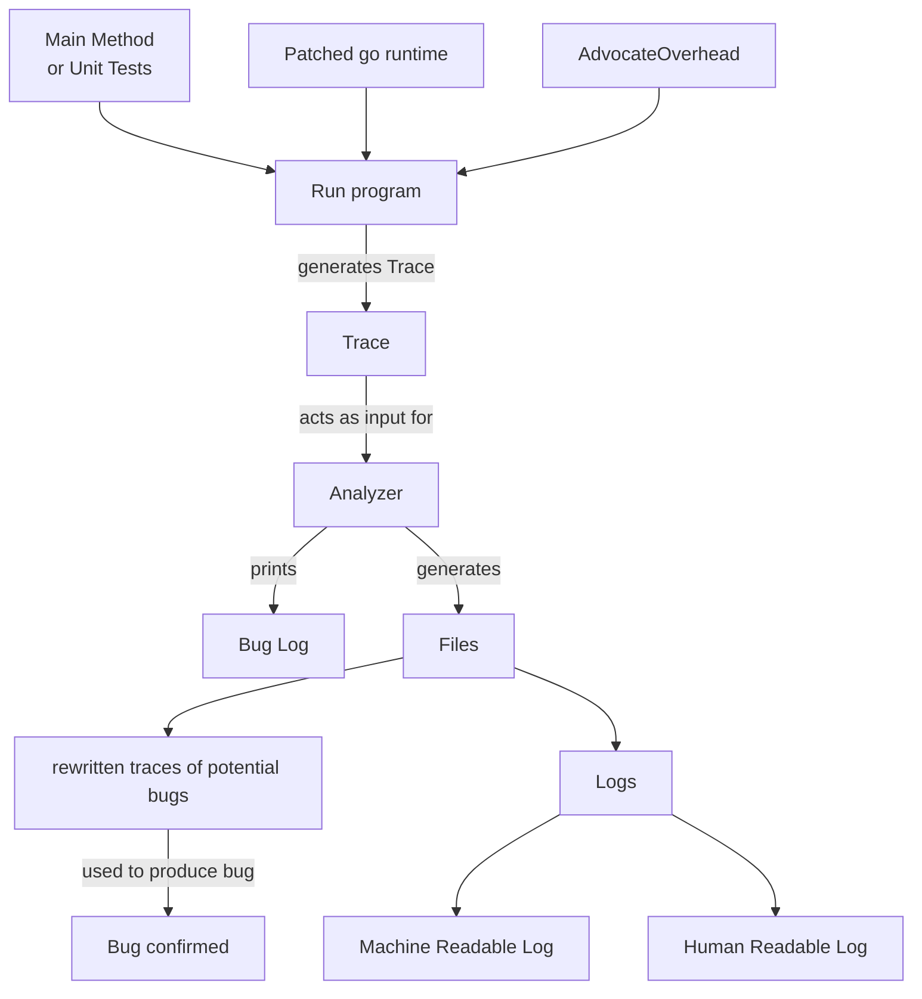

```mermaid
flowchart TD
MainUnit[Main Method \n or Unit Tests] --> Run[Run program]
PatchedGRT[Patched go runtime] --> Run
AdvocateOverhead --> Run
Run -->|generates Trace| Trace
Trace -->|acts as input for| Analyzer
Analyzer -->|prints| PotentialBugs[Bug Log]
Analyzer -->|generates| Files 
Files --> RewrittenTraces
Files --> Logs
Logs --> MachineRead[Machine Readable Log]
Logs --> HumanRead[Human Readable Log]
RewrittenTraces[rewritten traces of potential bugs]
RewrittenTraces -->|used to produce bug| ConfirmedBug[Bug confirmed] 

```