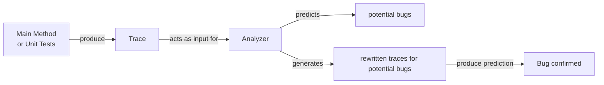

```mermaid
flowchart LR
Input[Main Method \n or Unit Tests] -->|produce| Trace
Trace -->|acts as input for| Analyzer
Analyzer -->|predicts| PotentialBugs[potential bugs]
Analyzer -->|generates| RewrittenTraces[rewritten traces for potential bugs]
RewrittenTraces -->|produce prediction| ConfirmedBug[Bug confirmed] 

```